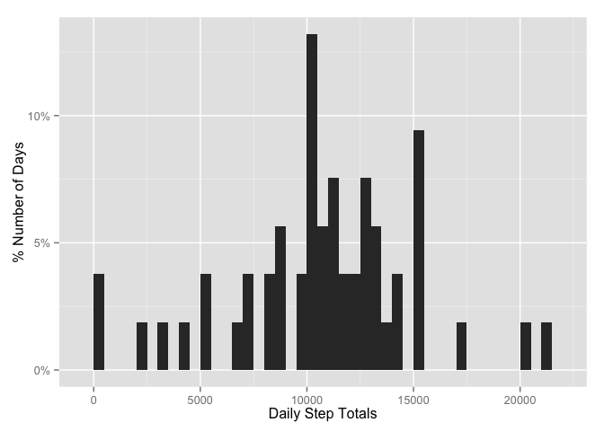

# Reproducible Research: Peer Assessment 1


## Loading and preprocessing the data
Load some required libraries

```r
library(dplyr)
```

```
## 
## Attaching package: 'dplyr'
## 
## The following object is masked from 'package:stats':
## 
##     filter
## 
## The following objects are masked from 'package:base':
## 
##     intersect, setdiff, setequal, union
```

```r
library(ggplot2)
```

```
## Warning: package 'ggplot2' was built under R version 3.1.3
```

```r
library(scales)
```

```
## Warning: package 'scales' was built under R version 3.1.3
```
  
After the required libraries are loaded, we can read in our dataset. 

```r
act <- read.csv("activity.csv")
```


## What is mean total number of steps taken per day?
To calculate the total number of steps taken per day, we can group the data by date and aggregate the number of steps with the following code:

```r
daysteps <- act %>% group_by(date) %>% summarize(totalsteps = sum(steps))
```
  
Once we have the data grouped and summarized appropriately, we can view some summary statistics on the total number of steps taken per day, including the median and mean.

```r
summary(daysteps$totalsteps)
```

```
##    Min. 1st Qu.  Median    Mean 3rd Qu.    Max.    NA's 
##      41    8841   10760   10770   13290   21190       8
```
Then we can plot a histogram of the Daily Step Totals

```r
ggplot(daysteps, aes(x=totalsteps, y=(..count..)/sum(..count..))) + 
  scale_y_continuous(labels = percent) +
  geom_histogram(binwidth=500) + 
  labs(x="Daily Step Totals", y="% Number of Days")
```

 

## What is the average daily activity pattern?

The step data is presented in 5 minute intervals by day in the dataset. To see the Average Daily Activity, we will need to aggregate the step counts by interval accross days, like so:

```r
intsteps <-aggregate(act[c(1,3)], by=list(act$interval), 
  FUN=mean, na.rm=TRUE)
```
  
Then we can plot the Average Number of Steps per 5 minute interval.   

```r
ggplot(intsteps, aes(x=interval, y=steps)) + geom_line() + labs(y="Average Steps", x="Interval")
```

 

We can see which interval has the highest Average Number of Steps using the following:

```r
intsteps[which.max(intsteps$steps), 2:3]
```

```
##        steps interval
## 104 206.1698      835
```
  
## Imputing missing values
  
There are many observations where the step count is NA in the dataset. The follwing code will tell us how many NA's are present in the datset:  


```r
sum(is.na(act$steps))
```

```
## [1] 2304
```

We can replace the NA's with the Average number of steps per interval and re-calculate the Daily Total Number of Steps.

```r
act2 <- left_join(act, intsteps, by="interval")
act2 <- act2 %>% mutate(msteps = ifelse(is.na(act2$steps.x), round(act2$steps.y, digits=0), act2$steps.x))
avgdaysteps <- act2 %>% group_by(date) %>% summarize(totalavgdaysteps = sum(msteps))
```
  
Then we can view the summarized statistics of the Daily Step Totals and see the Mean and Median

```r
summary(avgdaysteps$totalavgdaysteps)
```

```
##    Min. 1st Qu.  Median    Mean 3rd Qu.    Max. 
##      41    9819   10760   10770   12810   21190
```
  
Re-plot histogram of total steps taken per day with the replaced NA's.


```r
ggplot(avgdaysteps, aes(x=totalavgdaysteps, y=(..count..)/sum(..count..))) + 
  scale_y_continuous(labels = percent) +
  geom_histogram(binwidth=500) + 
  labs(x="Total Steps", y="% Number of Days")
```

 
  

## Are there differences in activity patterns between weekdays and weekends?
  
We can add the weekday names, and whether the day falls during the week or the weekend to the dataset like so:

```r
act3 <- act2 %>% mutate(idatetime = as.POSIXct(date, format="%Y-%m-%d")) %>% mutate(wnames = factor(format(idatetime,'%a'))) %>% mutate(wdaytype = factor(ifelse(wnames %in% c('Sat', 'Sun'), "Weekend", "Weekday")))
```
  
Then we calculate the Average Number of Steps per interval by the type of Day.

```r
avgintsteps <- act3 %>% group_by(wdaytype, interval) %>% summarize(avgsteps = mean(msteps))
```
  
Plot the Avg steps per interval by type of Day.  

```r
ggplot(avgintsteps, aes(x=interval, y=avgsteps)) + geom_line() + 
    ylab("Average steps") +
    facet_grid(wdaytype ~ .)
```

 
